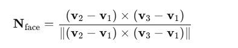

# 顶点法线和反射原理


**和平面垂直的是法线，入射光线和法线形成的夹角称之为入射角，反射角同理。**

## 一、光照材质的分类

- **MeshBasicMaterial**：基础材质，不受任何光照影响，颜色或贴图原样输出。
- **MeshLambertMaterial**：漫反射材质，根据朗伯漫反射模型计算明暗，亮度 ∝ 入射光线与法线夹角的余弦值，无高光。
- **MeshPhongMaterial**：镜面反射材质，除漫反射外还计算镜面高光，能够模拟光滑表面的高光效果。
- 

## 二、反射原理（统一基于法线）

1. **法线**： 与平面垂直的一条虚拟线，记作 `N`。
2. **入射角 (i)**： 入射光线 `L` 与法线 `N` 之间的夹角。
3. **反射角 (r)**： 反射光线 `R` 与法线 `N` 之间的夹角。**反射角等于入射角**。

### 1. 镜面反射示意图


在光滑平整的表面上，所有入射光线都有相同的法线方向，因而所有反射光线也在同一方向形成一致的镜面反射。

### 2. 漫反射示意图


在粗糙不平的表面上，每个点的法线朝向不同，故反射光线呈现各个方向的散射，这就是漫反射。

## 三、顶点法线（Vertex Normal）

- 在 Three.js 中，几何体的顶点位置由 `geometry.attributes.position` 定义，UV 坐标由 `geometry.attributes.uv` 定义。
- **顶点法线**则由 `geometry.attributes.normal` 定义，用来存储每个顶点处的法线方向。
- 例如 `BoxGeometry` 立方体共有 24 个顶点（每个面 4 个顶点），因此也有 24 个对应的法线向量，用于光照计算。


顶点法线（Vertex Normal）是定义在几何体顶点上的单位向量，用来描述顶点处表面的朝向。它在光照计算中起到关键作用——告诉 GPU 该顶点“面朝”哪个方向，从而决定它受光照时亮暗的变化。

### 为什么需要顶点法线

- **光照计算**：在顶点着色器或片元着色器中，需要知道光线与表面法线之间的夹角（θ），才能用漫反射（Lambert）或镜面反射（Phong）模型计算明暗或高光。
- **平滑过渡**：直接使用面法线（Face Normal）渲染，会让模型每个面都像被“切割”开，棱角分明；而顶点法线可以在相邻面之间插值，实现平滑光照过渡。

------

### 顶点法线如何定义

1. **Face Normal（面法线）**

   - 先计算三角形面片的法线：

     

   - 这条法线垂直于三角面。

2. **Vertex Normal（顶点法线）**

   - 将所有与该顶点相连的面法线作“加权平均”（通常按面面积或角度加权），再单位化（归一化）。
   - 结果是一个单位向量，既代表了该顶点周围各面的大致朝向，也保证了光照插值平滑。

------

### Three.js 中的顶点法线

- 在 `BufferGeometry`（包括 `BoxGeometry`、`SphereGeometry`、`TubeGeometry` 等）中，顶点法线存储在属性 `geometry.attributes.normal` 中：

  ```js
  // normal.array 是一个浮点数数组，长度 = 顶点数 × 3
  const normals = geometry.attributes.normal.array;
  ```

- Three.js 在创建标准几何体时，会帮你自动计算并填充这些法线；如果自己加载模型或动态修改顶点，需要手动调用：

  ```js
  geometry.computeVertexNormals();
  ```

------

### 顶点法线在光照中的作用

- **漫反射（Lambert）**

  

  其中 N 就是顶点法线，L 是光照方向。

- **镜面反射（Phong）**

  

  也需要法线 N 来计算反射向量 R。

------

### 小结

- **顶点法线**：描述顶点处表面朝向的单位向量；
- **作用**：参与光照模型计算，实现平滑的光照效果；
- **来源**：几何体预先计算或手动通过 `computeVertexNormals()` 生成。

掌握顶点法线的概念，有助于你更深入理解 Three.js 的光照和材质渲染原理，也能在自定义几何或模型导入时正确处理法线，获得理想的渲染效果。


# TubeGeometry 与样条曲线示例解析

下面这段代码示范了如何在 Three.js 中使用 **三次贝塞尔曲线**（Cubic Bezier Curve）与 **管道几何体**（TubeGeometry）来创建一段弯曲的“管道”模型。

```js
import * as THREE from 'three';

// 1. 定义四个控制点，用来描述三次贝塞尔曲线的走势
const p1 = new THREE.Vector3(-100, 0, 0)   // 起点
const p2 = new THREE.Vector3(50, 100, 0)   // 第一控制点
const p3 = new THREE.Vector3(100, 0, 100)  // 第二控制点
const p4 = new THREE.Vector3(100, 0, 0)    // 终点

// 2. 用这四个点创建一条三次贝塞尔曲线
const curve = new THREE.CubicBezierCurve3(p1, p2, p3, p4)

// 3. 基于曲线生成一个“管道”几何体
//    - curve：曲线路径
//    - 50    ：沿曲线方向分段数（细分程度）
//    - 10    ：管道截面的半径
//    - 20    ：管道截面圆周上分段数（圆环细分）
const geometry = new THREE.TubeGeometry(curve, 50, 10, 20)

// 4. 使用基础材质（不受光照影响）渲染管道网格
const material = new THREE.MeshBasicMaterial({
  color: new THREE.Color('white')
})

// 5. 创建网格并导出
const mesh = new THREE.Mesh(geometry, material)
export default mesh
```

## 关键步骤详解

1. **Vector3 控制点**
   - `p1`, `p2`, `p3`, `p4` 分别是贝塞尔曲线的起点、两个“拉拽”控制点以及终点。
   - 它们共同决定了曲线的弯曲形状。
2. **CubicBezierCurve3**
   - Three.js 提供的三维三次贝塞尔曲线类。
   - 接受 4 个 `Vector3` 点，内部根据贝塞尔公式计算任意 `t∈[0,1]` 时刻的曲线坐标。
3. **TubeGeometry**
   - 将一条曲线“扫”出一个管道形状。
   - 参数说明：
     - `path`：曲线路径对象，必须实现 `getPoint(t)` 方法（0–1 间取点）。
     - `tubularSegments`：沿曲线方向的分段数，数值越大管道越光滑。
     - `radius`：管道半径。
     - `radialSegments`：管道周向分段数，数值越大圆截面越圆润。
4. **MeshBasicMaterial**
   - 基础材质，不响应任何光照，常用于调试或需纯色／贴图效果时。
5. **组合成 Mesh 并导出**
   - `new THREE.Mesh(geometry, material)` 将几何体和材质绑定，得到可在场景中渲染的网格对象。
   - `export default mesh` 方便在其他模块中直接引入和添加到场景。

# BufferGeometry 与索引缓冲优化示例

下面的代码展示了如何使用 Three.js 的 `BufferGeometry` 手动构建一个简单的四面体，并通过 **索引缓冲（Index Buffer）** 避免重复顶点渲染，从而节省显存和提高渲染效率。

```js
import * as THREE from 'three';

// 1️⃣ 创建一个空的 BufferGeometry，用于自定义顶点数据
const geometry = new THREE.BufferGeometry();

// 2️⃣ 定义顶点位置数据（Float32Array）
//    每三个数为一组，代表一个顶点的 x、y、z 坐标
const vertices = new Float32Array([
  0,   0,   0,    // 顶点 0: 原点
  100, 0,   0,    // 顶点 1: x 轴正方向
  0,   100, 0,    // 顶点 2: y 轴正方向
  100, 100, -100  // 顶点 3: 偏离平面的第四个顶点
]);

// 3️⃣ 将顶点数组包装为 BufferAttribute，并指定 itemSize = 3（每 3 个元素组成一顶点）
//    然后赋值给 geometry.attributes.position，作为顶点位置属性
const positionAttribute = new THREE.BufferAttribute(vertices, 3);
geometry.attributes.position = positionAttribute;

// 4️⃣ 定义索引数组（Uint16Array）
//    用来告诉 GPU 按照哪些顶点组成三角形面片
//    这里共有两组三角形：
//      面片 A: 顶点 0, 1, 2
//      面片 B: 顶点 2, 1, 3
const indices = new Uint16Array([
  0, 1, 2,    // 第一个三角形
  2, 1, 3     // 第二个三角形
]);

// 5️⃣ 将索引数组包装为 BufferAttribute，并指定 itemSize = 1（每个元素为一个索引）
//    赋值给 geometry.index，启用索引缓冲
geometry.index = new THREE.BufferAttribute(indices, 1);

// 6️⃣ 创建基础材质（不响应光照），给网格上色
const material = new THREE.MeshBasicMaterial({
  color: new THREE.Color('orange')
});

// 7️⃣ 将几何体与材质组合成 Mesh，导出以便添加到场景
const mesh = new THREE.Mesh(geometry, material);
export default mesh;
```

## 为什么使用索引缓冲可以优化渲染？

1. **避免顶点重复定义**
   - 如果不使用 `geometry.index`，每个三角形都要在 `position` 数组里重复写相同的顶点坐标。
   - 对于复杂模型，顶点共享很常见，重复数据会浪费显存。
2. **共享顶点属性**
   - 启用索引后，不同面可以引用同一个顶点索引，共享相同的顶点坐标、法线、UV 等属性。
   - 修改顶点属性时，只需更新一次数据，即可影响所有共享该顶点的面片。
3. **减少 GPU 绘制调用**
   - GPU 在执行绘制时，会按照索引顺序读取顶点缓冲并组装三角形。
   - 索引模式通常比非索引模式更高效，能减少顶点着色器的执行次数。
4. **更好地支持顶点缓存**
   - 现代 GPU 有顶点缓存（Vertex Cache），能够重用最近访问的顶点数据。
   - 索引缓冲能够让相邻三角形重复利用缓存中的顶点，进一步提升性能。

------

**小结**：通过 `geometry.index = new THREE.BufferAttribute(indices, 1)`，你让 GPU 知道“用顶点 0、1、2 组成第一个三角形，用顶点 2、1、3 组成第二个三角形”，而不用在 `position` 数组里再写一次重复的坐标，达到了显存节省和渲染加速的效果。

在 Three.js（以及底层 WebGL）里，渲染一个三角网格实际上就是两件事情：

1. **顶点数据**：所有顶点的位置、法线、UV……都按顺序打包存放在 `geometry.attributes` 里。
2. **索引数据**：告诉 GPU “用哪些顶点组合成三角形” 的顺序，存放在 `geometry.index` 里。

------

## 一、geometry.attributes.position

```
js复制编辑// position.array = [ x0, y0, z0,   x1, y1, z1,   x2, y2, z2, … ]
geometry.attributes.position = new THREE.BufferAttribute( verticesArray, 3 );
```

- `position.array` 是一个扁平的浮点数组，按 **三连一组** 存放所有顶点的 XYZ 坐标。
- 数组长度 = 顶点数 × 3。
- GPU 会把这个数组上传到显存，为每个顶点分配一个编号（从 0 到 N-1），编号顺序就是数组里的先后顺序。

举例：

```
js复制编辑const vertices = new Float32Array([
  0, 0, 0,    // 顶点 0
  1, 0, 0,    // 顶点 1
  0, 1, 0,    // 顶点 2
  …           // 还有更多顶点
]);
```

------

## 二、geometry.index

```
js复制编辑// index.array = [ 0, 1, 2,   2, 1, 3,   … ]
geometry.index = new THREE.BufferAttribute( indicesArray, 1 );
```

- `index.array` 是一个扁平的整数数组，**每个值都是一个顶点编号**（对应上面 `position` 里某个顶点）。
- **每三个索引** 组成一个三角形：
  - 第一个三角形由 `index[0], index[1], index[2]` 三个顶点构成；
  - 第二个三角形由 `index[3], index[4], index[5]` 构成；依此类推。

举例：

```
js复制编辑const indices = new Uint16Array([
  0, 1, 2,   // 用 顶点0、1、2 组成第 1 个三角形
  2, 1, 3,   // 用 顶点2、1、3 组成第 2 个三角形
]);
```

------

## 三、它们是如何配合工作的？

1. Three.js 将 `position` 数组上传给 GPU，GPU 为每组三个坐标（x,y,z）分配一个 **顶点位置**。
2. 如果没有 `geometry.index`，GPU 就会 **按数组顺序**：
   - 顶点 0 → 三角形第一个顶点，
   - 顶点 1 → 三角形第二个顶点，
   - 顶点 2 → 三角形第三个顶点，
   - 然后紧接着顶点 3、4、5 又组成下一三角，…
3. 如果有 `geometry.index`，GPU **不管 position 数组里有多少顶点**，它只会按 `index` 数组里给出的顶点编号来“拉取”对应的顶点坐标，组装三角形。
   - 举例：`index = [2, 0, 1]`
     - GPU 先去 position 数组里找“第 2 个顶点”（即 `position.array[2*3..2*3+2]`）；
     - 再去找“第 0 个顶点”；
     - 再去找“第 1 个顶点”；
     - 把这三者连成一个三角形。

------

## 四、为什么要这样做？

1. **顶点共享**
   - 多个三角形如果共用同一个顶点（比如网格的相邻面），就只要在 `position` 数组里保存一次坐标，`index` 里多次引用该编号即可。
2. **节省显存**
   - 较复杂模型会大量共用顶点，索引缓冲能极大减少冻结数组体积。
3. **提高渲染效率**
   - GPU 顶点缓存（Post-Transform Cache）可以复用刚刚计算过的顶点数据，减少顶点着色器的重复执行。

------

### 总结

- **`geometry.attributes.position`**：存放顶点的 **实际坐标** （扁平数组，按顺序编号）。
- **`geometry.index`**：存放三角形 **顶点编号** 顺序（每 3 个编号组成一个三角形）。

它们共同告诉 GPU “世界空间里有哪些顶点？每个三角形由哪三个顶点组成？”，从而完成网格的渲染。


## 法线和光照

如果不设置法线normals，并且通过THREE.BufferAttribute(normals,3)来生成对应的法线信息赋值给geometry的attributes.normal，就会导致模型是看不见的。

**在 Three.js 中，法线（Normal）是三维模型表面上每个顶点的一个重要属性。它是一个向量，垂直于该顶点所在的表面，并指向表面的“外部”。**

为什么法线对于 MeshPhongMaterial 至关重要？

1. 光照计算：你使用的 MeshPhongMaterial 是一种模拟真实光照效果的材质。Phong 光照模型是一种计算光线如何与物体表面相互作用（例如，漫反射、镜面反射）的算法。这些计算强烈依赖于表面的法线信息。

- 漫反射：光线照射到粗糙表面时，会向各个方向均匀反射。法线决定了表面相对于光源的角度，从而影响漫反射的强度。

- 镜面反射：光线照射到光滑表面时，会在特定方向产生高光。法线的方向以及观察者视线的方向共同决定了高光的位置和强度。

2. 没有法线，无法确定表面朝向：如果一个几何体没有提供法线数据，渲染引擎就无法知道每个表面“朝向”哪个方向。对于像 MeshPhongMaterial 这样依赖光照计算的材质，如果无法确定表面朝向，就无法正确计算光线如何反射，最终可能导致以下情况：

- 模型看起来是黑色的，因为光照计算失败。

- 模型渲染不正确，出现奇怪的视觉效果。

- 在某些情况下，模型可能完全不可见。

```js
// 必须要定义法线，否则无法计算光照
const normals=new Float32Array([
  0,0,1, // 顶点0的法线 (指向Z轴正方向)
  0,0,1, // 顶点1的法线 (指向Z轴正方向)
  0,0,1, // 顶点2的法线 (指向Z轴正方向)
  0,0,1  // 顶点3的法线 (指向Z轴正方向)
])
geometry.attributes.normal=new THREE.BufferAttribute(normals,3)

// MeshPhongMaterial是Phong光照模型，可以模拟真实的光照效果,并且支持调节光泽度
const material=new THREE.MeshPhongMaterial({
  color:new THREE.Color('orange'),
  shininess:1000,
  // 光泽度，值越大，光泽度越高，表面越光滑
  // 0-1000，默认30
  // 如果设置为0，则表示没有光泽度，表面是哑光的
  // 如果设置为1000，则表示表面非常光滑，有镜面反射效果
  // 如果设置为500，则表示表面有一定的光泽度，有轻微的镜面反射效果
  // 如果设置为200，则表示表面有一定的光泽度，有轻微的镜面反射效果
})

const mesh=new THREE.Mesh(geometry,material)
```

你为四个顶点都指定了法线 (0,0,1)，这意味着这些顶点构成的所有面，其法线都指向 Z 轴的正方向。当光源照射到这个 mesh 时，Three.js 会使用这些法线信息和 MeshPhongMaterial 的属性（如颜色 orange 和光泽度 shininess）来计算最终的像素颜色。

## 简单理解——“法线”决定“光怎么打到表面上”

1. **什么是法线？**  
   - 法线（Normal）就是从表面“垂直”戳出去的一根虚拟小箭头，指向表面外侧。  
   - 它告诉我们：“这里的表面朝哪个方向朝向外面”。  

2. **光照原理：光线 vs. 法线**  
   - **入射光线**（L）：从光源射向表面的光线方向。  
   - **法线**（N）：表面在该点的“外向”方向。  
   - **关键**：光照亮度取决于 L 和 N 的夹角 θ：  
     > 漫反射亮度 ∝ max(0, N·L) （法线与光线越正对齐，亮度越高）  

3. **举例说明：**  
   
   ```text
           光源
            ↓ L
       ┌──────────┐   
       │ Surface  │   
       └──────────┘   
         ↑ N

- 当 `L` 几乎和 `N` 同向（θ≈0°）时，贴面你可以想象光“正面击中”，表面最亮。
- 当 `L` 与 `N` 差距很大（θ→90°），光“斜着打”或者几乎平行，照不到面，表面最暗。

1. **为什么改法线方向，光照就不同？**
   - 你在 `geometry.attributes.normal` 里给每个顶点设置了法线，就相当于告诉渲染器：
     - “这里的面朝向这个方向，如果用这个方向去和光源方向比，就算亮度。”
   - **法线越“正对”光源，点就越亮；法线越“背对”光源，点就越暗。**

### 总结

对于 MeshPhongMaterial 这种需要进行光照计算的材质，法线是必不可少的。它们告诉渲染引擎表面的朝向，从而能够正确模拟光线与表面的相互作用。没有法线，光照计算无法进行，模型也就无法正确显示出来。

如果你使用的是不需要光照的材质（例如 MeshBasicMaterial），那么即使不提供法线，模型通常也能显示出来，只是它不会有明暗变化，看起来会比较“平”。


