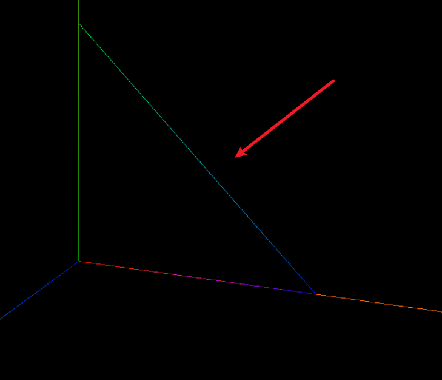
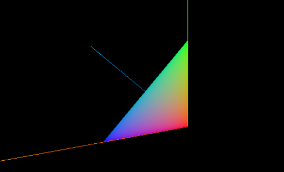

# 自定义顶点颜色实现渐变

```js
import * as THREE from 'three';

// 1️⃣ 创建一个空的 BufferGeometry，用于存储顶点数据
const geometry = new THREE.BufferGeometry();

// 2️⃣ 定义三个 Vector3 点，用来描述 Points 模型的顶点位置
const point1 = new THREE.Vector3(0,   0,   0)   // 顶点 A：原点
const point2 = new THREE.Vector3(0,   100, 0)   // 顶点 B：Y 轴正方向 100
const point3 = new THREE.Vector3(100, 0,   0)   // 顶点 C：X 轴正方向 100

// 3️⃣ 将这些 Vector3 点转换成 BufferGeometry 的 position 属性
geometry.setFromPoints([ point1, point2, point3 ])

// 4️⃣ 定义每个顶点对应的颜色（RGB 向量）
//    三个顶点分别是红、绿、蓝
const colors = new Float32Array([
  1, 0, 0,  // 顶点 A：红色
  0, 1, 0,  // 顶点 B：绿色
  0, 0, 1   // 顶点 C：蓝色
])
// 5️⃣ 将颜色数据包装成 BufferAttribute 并赋值给 geometry
geometry.attributes.color = new THREE.BufferAttribute(colors, 3)

// 6️⃣ 创建 PointsMaterial，启用顶点颜色，并设置点大小
const material = new THREE.PointsMaterial({
  vertexColors: true,  // 使用每个顶点的 color 属性
  size: 30             // 点的像素尺寸
})

// 7️⃣ 用 Points（点云）对象把几何体和材质组合起来
const mesh = new THREE.Points(geometry, material)

// 8️⃣ 导出 mesh，以便在场景中添加和渲染
export default mesh

```

在 Three.js 中，几何体（Geometry）可以有很多属性（Attributes），其中最重要的两个是顶点位置（position）和顶点颜色（color）。

1. 顶点位置：

- 代码中的 point1, point2, point3 定义了三个三维空间中的点。

- geometry.setFromPoints([ point1, point2, point3 ]) 这行代码将这三个点设置为了几何体的顶点位置。这决定了你看到的点云中每个点在空间中的具体位置。

2. 顶点颜色：

- colors 变量 (const colors = new Float32Array([...])) 是一个 Float32Array 类型的数组，它存储了每个顶点对应的颜色信息。

- **这个数组是“扁平化”的，每三个连续的数字代表一个顶点的 RGB (红、绿、蓝) 颜色值。**

- 1, 0, 0 代表第一个顶点（point1）的颜色，即红色 (R=1, G=0, B=0)。

- 0, 1, 0 代表第二个顶点（point2）的颜色，即绿色 (R=0, G=1, B=0)。

- 0, 0, 1 代表第三个顶点（point3）的颜色，即蓝色 (R=0, G=0, B=1)。

- geometry.attributes.color = new THREE.BufferAttribute(colors, 3) 这行代码做了两件事：

- **它创建了一个 BufferAttribute 对象。BufferAttribute 是 Three.js 用来高效存储和访问顶点数据的方式。**

- **参数 colors 是实际的颜色数据，参数 3 表示每个顶点颜色由 3 个分量（R, G, B）组成。**

- 然后，它将这个包含颜色数据的 BufferAttribute 赋值给了 geometry.attributes.color。这样，几何体就知道每个顶点应该是什么颜色了。

1. 材质（Material）如何使用颜色：

- const material = new THREE.PointsMaterial({ vertexColors: true, ... }) 创建了一个点材质。

- **关键在于 vertexColors: true 这个选项。它告诉渲染器：“不要使用材质的统一颜色（material.color），而是去查找并使用每个顶点自身定义的颜色数据（即我们刚刚通过 geometry.attributes.color 设置的那些颜色）”。**

总结一下：

你提到的“构建图形的顶点顺序”通常是指索引（Indices）。当绘制由多个三角形组成的面片（Mesh）时，会用到索引来指定哪些顶点组成一个三角形，以及这些三角形的绘制顺序。**但在当前这个例子中，我们创建的是 THREE.Points (点云)，每个顶点就是一个独立的点，它们之间没有连接关系形成面，所以这里不直接涉及你所说的“顶点顺序”来定义面的构建。**

colors 数组的顺序与顶点在 geometry.setFromPoints 中传入的顺序是一一对应的。第一个颜色值对应第一个顶点，第二个颜色值对应第二个顶点，以此类推。它本身不决定顶点的空间位置，而是为已经确定了位置的顶点赋予颜色。


## 线模型

如果我们切换为线模型



```js
// 5️⃣ 将颜色数据包装成 BufferAttribute 并赋值给 geometry
geometry.attributes.color = new THREE.BufferAttribute(colors, 3)

const material=new THREE.LineBasicMaterial({
  vertexColors:true,
})
```

生成的是渐变色的连线，坐标顶点对应的颜色在接近顶点是是原色状态。


## 网格模型

```js
const material=new THREE.MeshBasicMaterial({
  vertexColors:true,
})
```

这里顶点顺序是顺时针构成的三角形，是反面，默认不渲染正面，需要反过来看




# 曲线渐变

```js
// 导入 Three.js 库
import * as THREE from 'three';

// 创建一个空的 BufferGeometry 对象，用于存储自定义几何体的顶点数据等信息
const geometry = new THREE.BufferGeometry();

// 定义三个二维向量，用于描述二次贝塞尔曲线的起点、控制点和终点
const p1 = new THREE.Vector2(0, 0);       // 起点
const p2 = new THREE.Vector2(50, 200);    // 控制点
const p3 = new THREE.Vector2(100, 0);     // 终点

// 使用定义的三个点创建一条二次贝塞尔曲线
// p1 是起点，p2 是控制点，p3 是终点
const curve = new THREE.QuadraticBezierCurve(p1, p2, p3);

// 从贝塞尔曲线上获取 21 个点（因为 getPoints(20) 会返回 20+1 个点）
// 这些点将构成线的顶点
const pointsArr = curve.getPoints(20);

// 将从曲线上获取的点数组设置为几何体的顶点位置数据
geometry.setFromPoints(pointsArr);

// 获取几何体的位置属性，其中包含了所有顶点的坐标信息
const positions = geometry.attributes.position;

// 初始化一个空数组，用于存储每个顶点对应的颜色分量 (R, G, B)
const colorsArr = [];

// 遍历几何体的每一个顶点
for (let i = 0; i < positions.count; i++) {
  // 计算当前顶点在线条中的相对位置（百分比），范围从 0 到 1
  const percent = i / positions.count;
  // 根据相对位置为顶点设置颜色：R=0, G=percent, B=(1-percent)
  // 这会产生一个从蓝色 (0,0,1) 到青色 (0,1,0) 的渐变效果
  colorsArr.push(0, percent, 1 - percent);
}

// 将包含颜色分量的普通数组转换为 Float32Array 类型，这是 BufferAttribute 所需的格式
const colors = new Float32Array(colorsArr);

// 创建一个 BufferAttribute 来存储颜色数据，并将其赋值给几何体的 'color' 属性
// 第二个参数 3 表示每个顶点的颜色由三个分量（R, G, B）组成
geometry.attributes.color = new THREE.BufferAttribute(colors, 3);

// 创建一个基础线条材质（LineBasicMaterial）
const material = new THREE.LineBasicMaterial({
  // 关键属性：启用顶点颜色
  // 这会告诉渲染器使用每个顶点自身定义的颜色，而不是材质的统一颜色
  vertexColors: true
});

// 使用定义的几何体和材质创建一个线条对象（Line）
const line = new THREE.Line(geometry, material);

// 导出创建的线条对象，使其可以在其他模块中被导入和使用
export default line;
```

这段代码的目的是在 Three.js 中创建一条带有颜色渐变的二次贝塞尔曲线。

## 创建几何体

- const geometry = new THREE.BufferGeometry();

- BufferGeometry 是 Three.js 中表示几何体顶点数据的一种高效方式。这里创建了一个空的 BufferGeometry，稍后会填充顶点位置和颜色信息。

### 定义曲线控制点

```typescript
const p1 = new THREE.Vector2(0, 0);

const p2 = new THREE.Vector2(50, 200);

const p3 = new THREE.Vector2(100, 0);
```

- 这三行代码定义了三个二维向量 (Vector2)。这些点将用来定义一条二次贝塞尔曲线：

- p1: 曲线的起点。

- p2: 曲线的控制点，决定曲线的弯曲程度和方向。

- p3: 曲线的终点。

## 创建二次贝塞尔曲线

```typescript
const curve = new THREE.QuadraticBezierCurve(p1, p2, p3);
```

- 使用上面定义的三个点，创建了一个 QuadraticBezierCurve 对象。

### 从曲线上采样点

```typescript
const pointsArr = curve.getPoints(20);
```

- curve.getPoints(n) 方法会沿着贝塞尔曲线均匀地计算出 n+1 个点。所以 curve.getPoints(20) 会返回 21 个 Vector2 对象，这些点将构成我们线条的骨架。

## 设置几何体的顶点

```typescript
geometry.setFromPoints(pointsArr);
```

- 这个方法接收一个点数组（pointsArr），并将这些点设置为 geometry 的顶点位置。**这会自动创建并填充 geometry.attributes.position 这个 BufferAttribute。**

## 获取位置属性

```typescript
const positions = geometry.attributes.position;
```

- 获取对几何体位置属性的引用。positions.count 可以得到顶点的数量（在这个例子中是 21）。

## 构建颜色数据

```typescript
// 初始化一个空数组，用于存储每个顶点对应的颜色分量 (R, G, B)
const colorsArr = [];

// 遍历几何体的每一个顶点
for (let i = 0; i < positions.count; i++) {
  // 计算当前顶点在线条中的相对位置（百分比），范围从 0 到 1
  const percent = i / positions.count;
  // 根据相对位置为顶点设置颜色：R=0, G=percent, B=(1-percent)
  // 这会产生一个从蓝色 (0,0,1) 到青色 (0,1,0) 的渐变效果
  colorsArr.push(0, percent, 1 - percent);
}

// 将包含颜色分量的普通数组转换为 Float32Array 类型，这是 BufferAttribute 所需的格式
const colors = new Float32Array(colorsArr);

// 创建一个 BufferAttribute 来存储颜色数据，并将其赋值给几何体的 'color' 属性
// 第二个参数 3 表示每个顶点的颜色由三个分量（R, G, B）组成
geometry.attributes.color = new THREE.BufferAttribute(colors, 3);
```

- 初始化一个空数组 colorsArr，用于临时存储每个顶点的 RGB 颜色值。

- for (let i = 0; i < positions.count; i++) { ... }：遍历每一个顶点。

- const percent = i / positions.count;: 计算一个从 0 到接近 1 的百分比。

- colorsArr.push(0, percent, 1 - percent);: 为当前顶点添加颜色。

- 红色分量 (R) 始终为 0。

- 绿色分量 (G) 为 percent，所以它会随着顶点在线条上的推进从 0 渐变到 1。

- 蓝色分量 (B) 为 1 - percent，所以它会随着顶点在线条上的推进从 1 渐变到 0。

- 综合起来，这将产生一个从蓝色 (0,0,1) 开始，逐渐过渡到青色 (0,1,0) 的颜色渐变效果。

### 创建颜色 BufferAttribute

- const colors = new Float32Array(colorsArr);

- Three.js 的 BufferAttribute 通常需要 Float32Array 类型的数据。这行代码将包含颜色分量的 colorsArr 转换为 Float32Array。

- geometry.attributes.color = new THREE.BufferAttribute(colors, 3);

- 创建一个新的 BufferAttribute 来存储颜色数据。

- colors: 包含实际颜色数据的 Float32Array。

- 3: 表示每个属性（在这里是颜色）由 3 个分量组成（R、G、B）。

- 然后，将这个颜色属性赋值给 geometry.attributes.color。这样，几何体的每个顶点就都有了与之关联的颜色信息。

### 创建材质

- const material = new THREE.LineBasicMaterial({ vertexColors: true });

- 创建了一个基础线条材质 LineBasicMaterial。

- vertexColors: true 是一个非常重要的配置。它告诉材质在渲染时，应该使用几何体每个顶点上定义的颜色 (geometry.attributes.color)，而不是使用材质本身可能定义的单一颜色 (如 material.color)。如果这个选项为 false (默认值)，那么整条线将是材质指定的单一颜色。

### 创建线条对象

- const line = new THREE.Line(geometry, material);

- 使用之前创建的 geometry (包含了顶点位置和顶点颜色) 和 material (配置为使用顶点颜色) 来创建一个 THREE.Line 对象。这是一个可以在场景中渲染的 3D 对象。

总的来说，这段代码高效地定义了一条曲线的形状，并为曲线上的每个点动态计算了颜色，从而实现了一条平滑的颜色渐变线段。


## 颜色渐变优化

```js
const color1 = new THREE.Color('orange'); // 定义起点颜色为橙色
const color2 = new THREE.Color('blue');   // 定义终点颜色为蓝色

// 仍然遍历几何体的每一个顶点
for (let i = 0; i < positions.count; i++) {
  // 计算当前顶点在线条中的相对位置（百分比），范围从 0 到 1
  // 这个百分比现在直接用于 lerp 方法
  const percent = i / positions.count;

  // 关键步骤：颜色插值
  // 1. color1.clone(): 克隆起点颜色。
  //    这是因为 .lerp() 方法会直接修改调用它的颜色对象。
  //    如果我们不克隆，那么在下一次迭代中，color1 就会变成上一次插值的结果。
  // 2. .lerp(color2, percent): 进行线性插值。
  //    这个方法会将克隆出的 color1 向 color2 进行插值。
  //    - 当 percent 为 0 时，结果颜色就是 color1 (橙色)。
  //    - 当 percent 为 1 时，结果颜色就是 color2 (蓝色)。
  //    - 当 percent 在 0 和 1 之间时，结果颜色是 color1 和 color2 之间的混合色。
  //      例如，percent 为 0.5 时，颜色是橙色和蓝色各占一半的混合色。
  const color = color1.clone().lerp(color2, percent);

  // 将插值计算得到的颜色对象的 R, G, B 分量添加到 colorsArr 数组中
  colorsArr.push(color.r, color.g, color.b);
```

1. 更直观：你只需要定义起点颜色 (color1) 和终点颜色 (color2)，lerp 方法会自动处理中间颜色的计算。你不再需要像之前那样手动推导 colorsArr.push(0, percent, 1 - percent); 这样的公式。
2. 灵活性高：如果想改变渐变的起始或结束颜色，只需要修改 new THREE.Color('orange') 或 new THREE.Color('blue') 中的颜色字符串即可，例如改成 'red', '#FF00FF', 0x00ff00 等。
3. 代码更简洁：对于颜色混合的逻辑，color1.clone().lerp(color2, percent) 这一行代码清晰地表达了意图。

所以，是的，通过 THREE.Color 对象和它的 lerp 方法，你可以非常方便地实现两种颜色之间的平滑渐变，而无需手动计算每个颜色通道的插值。percent 变量仍然是需要的，它决定了当前顶点在从 color1 到 color2 的渐变过程中的具体位置。